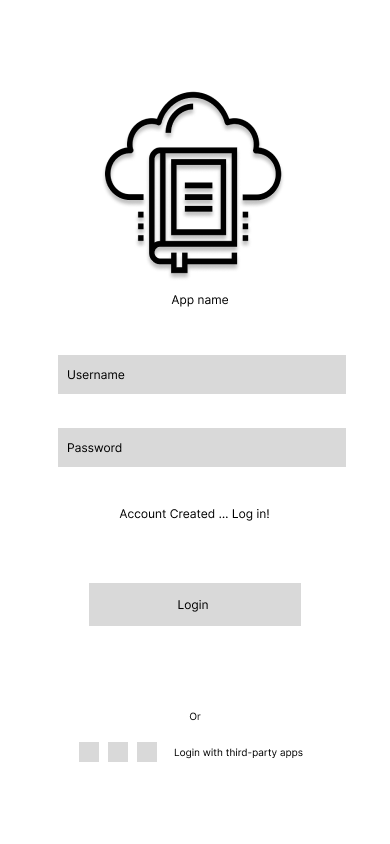

# User Experience Design

This repository contains instructions and files for two assignments that together comprise the user experience design phase of a web app.

Replace the contents of this file with the completed assignments, as described in:

- [app map & wireframe instructions](instructions-0a-app-map-wireframes.md).
- [prototype instructions](instructions-0b-prototyping.md)

# Wireframe Annotations/Descriptions 

#1 - Log In

 

#1 - Sign-up/New Profile

  

#2 - Homepage

  
- [Homepage is personalized to the user as it contains their current reads and suggestion for the reader
based on the genres,authors,etc they have read before. Not only this but the homepage also displays the user's
friends current reads and the top 10 books of the week. The homepage is also where the navbar is first presented
to the user, allowing them access to go between pages.]
Notes: 
- [each section moves horizontally based on how much data there is]

#3 - Profile view 

 

#4 - Book page 

 

- I added two screens. 
1: Books read which showcases the books you have read, a photo of the cover , and the title and author. 
2: Books want to read which showcases the books you want to read, a photo of the cover , and the title and author. 

#5 - Friend's Book view

 

- Friend's book view is accessed once the user clicks on one of their friend's current reads that is 
displayed on the Homepage. Once the user clicks one of the books, they will be shown a screen that 
gives further details of that friend's current book -- including their reading progress, overall star rate 
of the book and a description of the book.
Notes: 
- The book and info page move vertically to display more info as the user swipes down.

#6 - Friends List 

 

- Friends List view is accessed through the navbar 'friends' option that is displayed. Once the user 
clicks on this, the display will show a list of their friends with their name and the book they are currently 
reading along with the author's name underneath.

