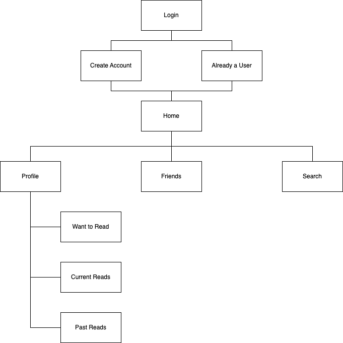

# User Experience Design

# Link to figma prototype

# App Map

# Wireframe Annotations/Descriptions

[**Prototype and Wireframe**](https://www.figma.com/file/GAfeFkQj6gh0whKbp6WvLe/Prototype-%231?type=design&node-id=0%3A1&mode=design&t=2AdOSfrzjfudxNQg-1)

## Log In

- A simple login page that asks a user for a `Username` and `Password`. If the user does not have a profile, they can click `Sign Up` or `Login with third-party apps`.

## Sign-up/New Profile

  

- A simple page Sign-up page for new users where they can add their `First`, `Last` name, `Email`, and `Password`. If they have an account, they go back to `Login`.

## Homepage

  

- Homepage is personalized to the user as it contains their current reads and suggestion for the reader
based on the genres,authors,etc they have read before. Not only this but the homepage also displays the user's
friends current reads and the top 10 books of the week. The homepage is also where the navbar is first presented
to the user, allowing them access to go between pages.
Notes:
- each section moves horizontally based on how much data there is

## Profile view

- The profile display’s the user’s public information, including their name, username, number of friends, profile picture, and bio. The profile is accessible through the navbar.
- The profile page also displays the top 4 books in the user’s Current Reads, Want to Read, and Past Reads sections. By clicking on the text of the section, the user can go to a page that displays all of their books saved under that category.
- The page also includes an ‘Edit profile’ button which leads to a page that allows the user to change their public information and private information (including email address and password).

## Book page

- Accessible at multiple points throughout the app, this page shows basic information about the selected book, including its title, author, image, page count, description, and star rate of the book.

## Friend's Book view

- Friend's book view is accessed once the user clicks on one of their friend's current reads that is
displayed on the Homepage. Once the user clicks one of the books, they will be shown a screen that
gives further details of that friend's current book -- including their reading progress, overall star rate
of the book and a description of the book.
Notes:
- The book and info page move vertically to display more info as the user swipes down.

## Friends List

- Friends List view is accessed through the navbar 'friends' option that is displayed. Once the user
clicks on this, the display will show a list of their friends with their name and the book they are currently
reading along with the author's name underneath.

## Books read

- Showcases the books the user has saved to their completed books list. Allows the user to click individual books for more information.

## Books want to read

- Showcases the books the user has saved to their Want to Read books list. Allows the user to click individual books for more information.
